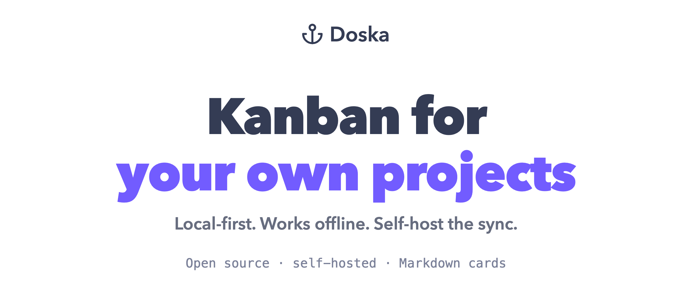

<div align="center">

<picture>
  <source media="(prefers-color-scheme: dark)" srcset=".github/assets/hero-dark-v2.png">
  <source media="(prefers-color-scheme: light)" srcset=".github/assets/hero-light-v2.png">
  
</picture>

<p align="center">
  <a href="https://github.com/romenkova/doska/releases/latest"></a>
  <a href="LICENSE"></a>
  <br>
  <a href="https://github.com/romenkova/doska/actions/workflows/build.yml"></a>
  <a href="https://github.com/romenkova/doska/actions/workflows/test.yml"></a>
  <a href="https://github.com/romenkova/doska/actions/workflows/e2e.yml"></a>
  <a href="https://github.com/romenkova/doska/actions/workflows/selfhost.yml"></a>
</p>

<p align="center">
  <strong><a href="https://app.doska.sh/d/welcome">Open demo</a></strong> ·
  <a href="https://doska.sh/docs">Documentation</a> ·
  <a href="https://github.com/romenkova/doska/releases/latest">Download for macOS</a> ·
  <a href="https://app.doska.sh/p/2af2848df270cb5b8a4e73e7a362b19b">Roadmap</a> ·
  <a href="https://doska.sh/docs/mcp">MCP</a>
</p>

<picture>
  <source media="(prefers-color-scheme: dark)" srcset=".github/assets/board-dark.png">
  <source media="(prefers-color-scheme: light)" srcset=".github/assets/board-light.png">
  
</picture>

</div>

A Kanban board where the cards are Markdown. It's local-first: your boards live
in the browser (IndexedDB), so it's fast and works without an account. Sync is
opt-in. Point it at a server you run and that server keeps the canonical copy,
replicated to every device.

Runs in the browser, installs as a PWA, or ships as a native macOS app.

📖 **[Documentation](https://doska.sh/docs)**: [self-hosting](https://doska.sh/docs/self-hosting),
[environment variables](https://doska.sh/docs/self-hosting/environment),
[HTTPS](https://doska.sh/docs/self-hosting/https),
[attachments](https://doska.sh/docs/self-hosting/attachments),
[backups](https://doska.sh/docs/self-hosting/backups),
[sync](https://doska.sh/docs/sync), [accounts](https://doska.sh/docs/accounts),
[public sharing](https://doska.sh/docs/public-sharing),
[MCP](https://doska.sh/docs/mcp).

## Features

### Cards

- **Multiple boards**, each with draggable columns. Drag cards to reorder or
  move them between columns.
- Cards are **GitHub-flavored Markdown**, edited in place: bold, code, links,
  highlights, and task lists that carry a live count in the card header. A slash
  menu and inline suggestions for formatting.
- **Attach files** by dropping them on a card or pasting from the clipboard;
  images preview inline. They land in a local volume, and an S3-compatible
  bucket is the alternative.
- **Cards link to cards** (wikilink): type `[[` and pick one. The reference
  carries that card's live title and column color.
- **Deadlines**: set one and the card shows a chip that shifts color as the date
  nears, turning red once it's overdue.
- An **Upcoming** view gathers cards from every board by deadline: overdue ones
  first, then grouped by day.

### Where it lives

- **Local-first** storage (IndexedDB): reads and writes hit the browser, not the
  network, so the UI is instant and works offline.
- **Opt-in sync**: give it a server you control and boards replicate across your
  devices in the background, every couple of seconds or on `⌘`+`S`. How it works:
  [doska.sh/docs/sync](https://doska.sh/docs/sync).
- **Deleting is reversible**. `⌘`+`Z` takes back the last delete; everything
  else waits in the trash for 14 days.
- **More than one account per server.** The admin adds accounts from the
  **Accounts** screen, sets passwords and deactivates; Each account's boards are its own:
  [doska.sh/docs/accounts](https://doska.sh/docs/accounts).
- **Share a board** with other accounts on your server, and the board syncs to everyone on it.
- **Publish a board** to a read-only link that needs no account and keeps
  nothing in the visitor's browser. Turn it off and the link is dead:
  [doska.sh/docs/public-sharing](https://doska.sh/docs/public-sharing).

### Run it

- Runs **in the browser**, installs as a **PWA** (fullscreen and offline from
  your phone's home screen), or ships as a **Tauri macOS app** that reuses the
  same client and auto-updates.
- **One-line self-host installer** that generates the secrets and brings the
  stack up.
- Boards are exposed over [**MCP**](#mcp), so an agent can read and edit them.
- **Dark and light themes.**

## Self-hosting

Run your own server to keep your boards for real and sync them across devices.
Without one they live only in the browser: fine for trying it out, not for
anything you want to keep.

```sh
curl -fsSL https://raw.githubusercontent.com/romenkova/doska/main/install.sh -o install.sh && sh install.sh
```

Then open `http://<your-host>:8080` and sign in with the credentials you gave it.

Setting it up by hand, every environment variable, HTTPS, attachments and
backups: [doska.sh/docs/self-hosting](https://doska.sh/docs/self-hosting).

> Browser storage isn't permanent. The app asks the browser not to evict it, but
> that's best-effort: the browser can still clear it, and "clear site data"
> always will. 

## Updating

The script changes between releases, run full command. It keeps your existing `.env` and
takes a backup of the database and files before redeploying over them.

```sh
curl -fsSL https://raw.githubusercontent.com/romenkova/doska/main/install.sh -o install.sh && sh install.sh
```

The desktop app follows whatever version its server runs, so update the server
first. The app then offers the matching build and installs it on relaunch.

## Desktop app

Download the latest macOS build from
[Releases](https://github.com/romenkova/doska/releases/latest). It wraps the same
client (with Tauri), is signed and notarized, and auto-updates.
[doska.sh/docs/desktop](https://doska.sh/docs/desktop).

## MCP

The server exposes your boards to an MCP client (Claude Code, Claude Desktop,
claude.ai) at `/mcp`, so an agent can create cards, tick off task lists and move
things between columns:

```sh
claude mcp add --transport http doska https://your-server/mcp
```

Tools are listed in [packages/mcp/README.md](packages/mcp/README.md); setup is at
[doska.sh/docs/mcp](https://doska.sh/docs/mcp).

## Development

```sh
pnpm install
pnpm dev        # web client + server, in watch mode
pnpm desktop    # native desktop shell (Tauri)
```

Requirements, the full command list and the repository layout:
[doska.sh/docs/development](https://doska.sh/docs/development).

## License

See [LICENSE](LICENSE).
