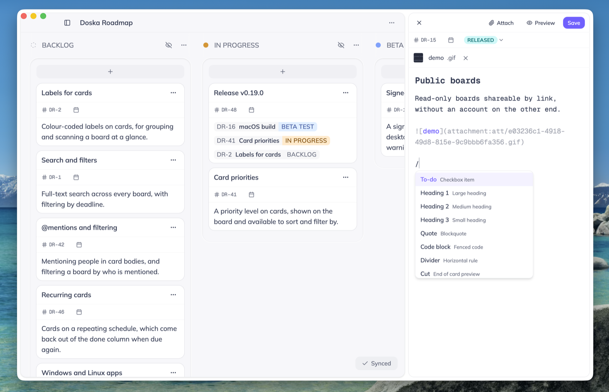

<div align="center">

<picture>
  <source media="(prefers-color-scheme: dark)" srcset=".github/assets/logo-dark.png">
  <source media="(prefers-color-scheme: light)" srcset=".github/assets/logo-light.png">
  
</picture>
<p></p>

<picture>
  <source media="(prefers-color-scheme: dark)" srcset=".github/assets/tagline-dark.png">
  <source media="(prefers-color-scheme: light)" srcset=".github/assets/tagline-light.png">
  
</picture>
<p></p>

<p align="center">
  <a href="https://github.com/romenkova/doska/releases/latest"></a>
  <a href="LICENSE"></a>
</p>
<p></p>

<p align="center">
  <strong><a href="https://app.doska.sh/d/welcome">Open demo</a></strong> ·
  <a href="https://doska.sh/docs">Documentation</a> ·
  <a href="https://github.com/romenkova/doska/releases/latest">Download for macOS</a> ·
  <a href="https://app.doska.sh/p/2af2848df270cb5b8a4e73e7a362b19b">Roadmap</a> ·
  <a href="https://doska.sh/docs/mcp">MCP</a>
</p>

<picture>
  <source media="(prefers-color-scheme: dark)" srcset=".github/assets/board-dark.png">
  <source media="(prefers-color-scheme: light)" srcset=".github/assets/board-light.png">
  
</picture>

</div>

## What's new

- **Cards tab in the sidebar**: the open cards from every board — the first two
  columns of each — in priority order, ten at a time. A row carries its
  column's color, and clicking it opens that card on its board.
- **Priority is a number** from 0 to 100, higher first, 0 for none. It sits in
  the card's title row and is edited in place; cards written on the old
  high / medium / low scale read 75 / 50 / 25.
- **Resizable columns**: drag a column's right edge. Each width is remembered
  on that device and restored next time.
- **Drag a card onto another board**: drop it on a board in the sidebar and it
  moves there, to the top of that board's first column.
- **Boards nest and reorder**: drag a sidebar row between rows to reorder it,
  or onto a row to nest it underneath. Nesting is organizational only — the
  board's columns and cards are untouched.
- **A card's notes preview** on the board is one compact line.
- **Tooltips on the icon-only controls** — the board header, the column
  headers, the card panel, attachments — naming what each does, and the
  keyboard shortcut where there is one.

## Features

### Cards

- **Multiple boards**, each with draggable columns you can resize, and boards
  themselves nest and reorder in the sidebar.
- Cards are **GitHub-flavored Markdown**. A slash menu and inline suggestions for formatting.
- **Attach files** by dropping them on a card or pasting from the clipboard.
- **Cards link to cards**: type `[[` and pick one. The reference
  carries that card's live title and column color.
- **Deadlines**: set one and the card shows a chip that shifts color as the date
  nears, turning red once it's overdue.
- **Priority**: a number from 0 to 100 on a card, edited in its title row, and a
  board can be sorted by it.
- An **Upcoming** view gathers cards from every board by deadline: overdue ones
  first, then grouped by day.

### Where it lives

- **Local-first** storage: reads and writes hit the browser, not the
  network, so the UI is instant and works offline.
- **Opt-in sync**: give it a server you control and boards replicate across your
  devices in the background. How it works:
  [doska.sh/docs/sync](https://doska.sh/docs/sync).
- **Deleting is reversible**. everything waits in the trash for 14 days.
- **More than one account per server.** The admin adds accounts, sets passwords and deactivates; Each account's boards are its own:
  [doska.sh/docs/accounts](https://doska.sh/docs/accounts).
- **Share a board** with other accounts on your server, and the board syncs to everyone on it.
- **Publish a board** to a read-only link:
  [doska.sh/docs/public-sharing](https://doska.sh/docs/public-sharing).

### Run it

- Runs **in the browser**, installs as a **PWA**, or ships as a **Tauri macOS app**.
- **One-line self-host installer** that generates the secrets and brings the
  stack up.
- Boards are exposed over [**MCP**](#mcp), so an agent can read and edit them.
- **Dark and light themes.**

## Self-hosting

Run your own server to keep your boards for real and sync them across devices.
Without one they live only in the browser: fine for trying it out, not for
anything you want to keep.

```sh
curl -fsSL https://raw.githubusercontent.com/romenkova/doska/main/install.sh -o install.sh && sh install.sh
```

Then open `http://<your-host>:8080` and sign in with the credentials you gave it.

Setting it up by hand, every environment variable, HTTPS, attachments and
backups: [doska.sh/docs/self-hosting](https://doska.sh/docs/self-hosting).

> Browser storage isn't permanent. The app asks the browser not to evict it, but
> that's best-effort: the browser can still clear it, and "clear site data"
> always will. 

## Updating

The script changes between releases, run full command. It keeps your existing `.env` and
takes a backup of the database and files before redeploying over them.

```sh
curl -fsSL https://raw.githubusercontent.com/romenkova/doska/main/install.sh -o install.sh && sh install.sh
```

The desktop app follows whatever version its server runs, so update the server
first. The app then offers the matching build and installs it on relaunch.

## Desktop app

Download the latest macOS build from
[Releases](https://github.com/romenkova/doska/releases/latest). It wraps the same
client (with Tauri), is signed and notarized, and auto-updates.
[doska.sh/docs/desktop](https://doska.sh/docs/desktop).

## MCP

The server exposes your boards to an MCP client (Claude Code, Claude Desktop,
claude.ai) at `/mcp`, so an agent can create cards, tick off task lists and move
things between columns:

```sh
claude mcp add --transport http doska https://your-server/mcp
```

Tools are listed in [packages/mcp/README.md](packages/mcp/README.md); setup is at
[doska.sh/docs/mcp](https://doska.sh/docs/mcp).

## Development

```sh
pnpm install
pnpm dev        # web client + server, in watch mode
pnpm desktop    # native desktop shell (Tauri)
```

Requirements, the full command list and the repository layout:
[doska.sh/docs/development](https://doska.sh/docs/development).

## License

See [LICENSE](LICENSE).
